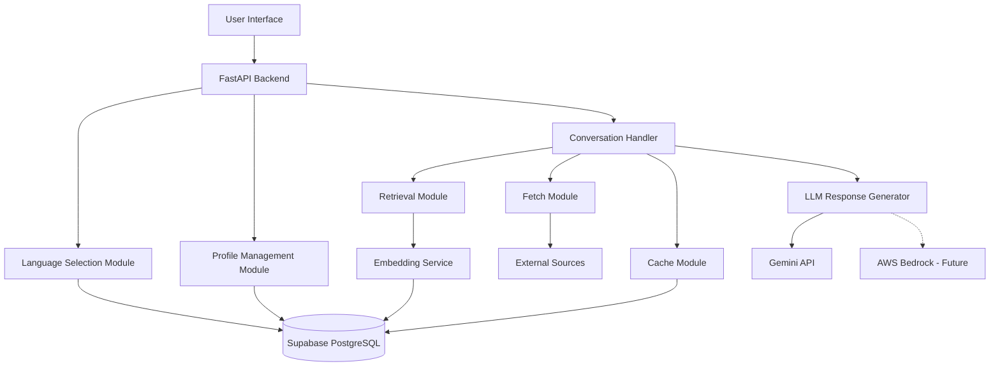
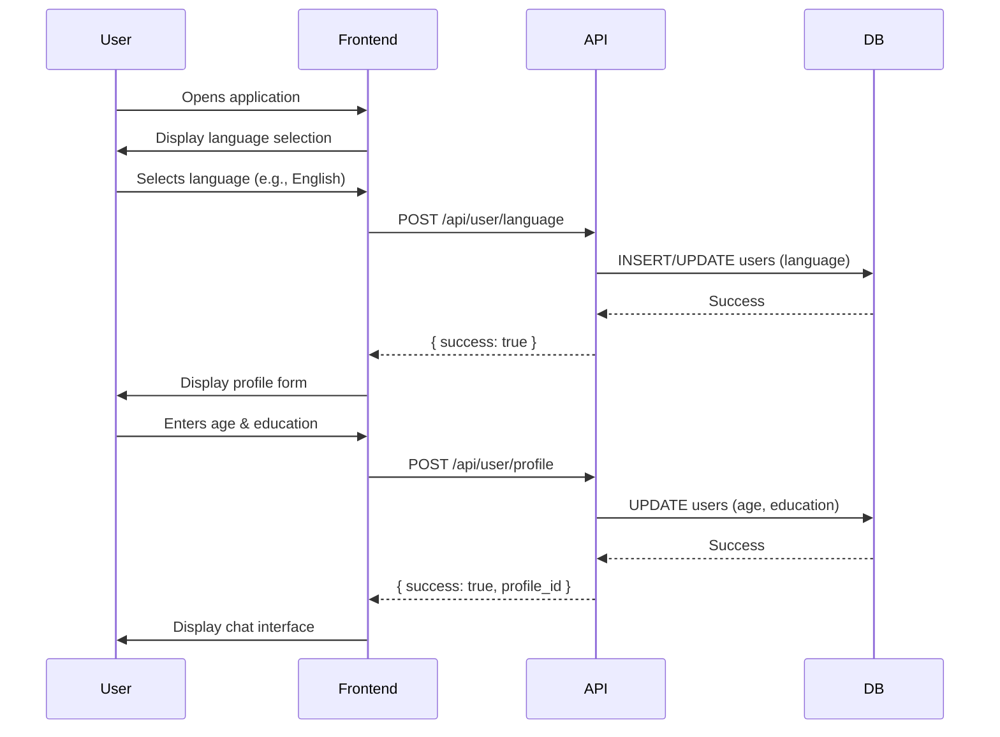
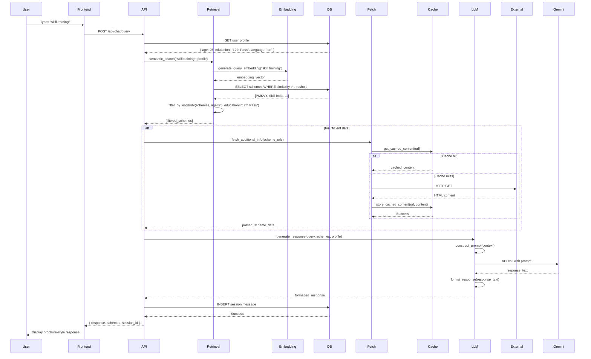
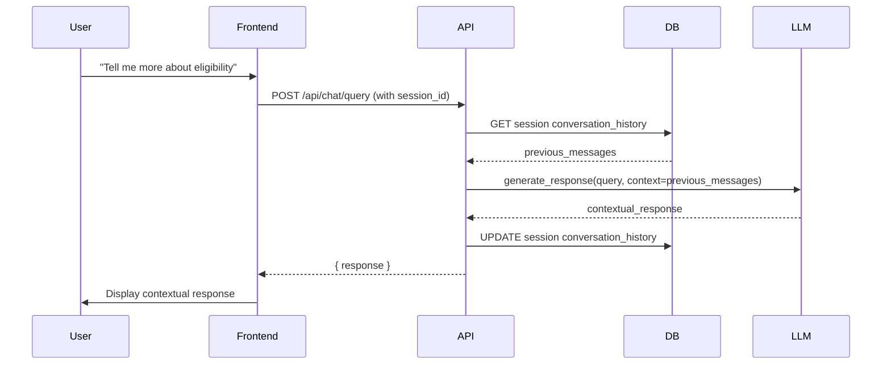

# Design Document: BharatConnect AI

## Overview

BharatConnect AI is a hybrid Retrieval-Augmented Generation (RAG) system that provides an accessible, conversational interface for discovering government schemes and opportunities. The system follows a language-first approach where users select their preferred language before any interaction, provide their profile once (age and education), and then engage in natural conversation using keywords or incomplete sentences.

The core architecture implements a four-stage pipeline: **Retrieve → Fetch → Cache → Respond**. This design ensures that responses are grounded in real data (preventing hallucinations), personalized to user profiles, and delivered efficiently through intelligent caching.

The system is built for accessibility, targeting rural and semi-urban youth, elderly citizens, and low digitally literate users in India. Every design decision prioritizes simplicity, trust, and inclusivity.

## Architecture

### High-Level Architecture



### Architecture Principles

1. **Language-First UX**: Language selection is the mandatory first interaction, ensuring all subsequent interactions are in the user's preferred language
2. **Profile-Once Pattern**: User profile (age, education) is collected once and reused for all personalization
3. **Grounded Generation**: All AI responses are based on retrieved or fetched data, never hallucinated
4. **Hybrid RAG**: Combines database retrieval with on-demand external fetching for comprehensive coverage
5. **Swappable LLM**: Abstraction layer allows replacing Gemini with AWS Bedrock without architectural changes
6. **Cache-First Strategy**: Reduces external requests and improves response time through intelligent caching

### Technology Stack

- **Frontend**: React or Vue.js with mobile-first responsive design
- **Backend**: Python 3.10+ with FastAPI framework
- **Database**: Supabase (PostgreSQL) for structured data storage
- **Embeddings**: Sentence-Transformers (all-MiniLM-L6-v2 or multilingual model)
- **Web Scraping**: Requests + BeautifulSoup4 for fetching external content
- **LLM**: Google Gemini API (with abstraction for AWS Bedrock compatibility)
- **Deployment**: Docker containers, deployable on AWS ECS/Lambda or equivalent

## Components and Interfaces

### 1. Frontend Component

**Responsibility**: Provide an accessible, conversational interface for users

**Key Features**:
- Language selection screen (mandatory first screen)
- Profile collection form (age + education dropdown)
- Chat-style conversational interface
- Scheme display in brochure-style format
- Mobile-first responsive design

**Interface with Backend**:
- `POST /api/user/language` - Set user language preference
- `POST /api/user/profile` - Submit user profile (age, education)
- `GET /api/user/profile` - Retrieve existing user profile
- `POST /api/chat/query` - Submit conversational query
- `GET /api/chat/history` - Retrieve conversation history

**Design Considerations**:
- Large, readable fonts (minimum 16px)
- High contrast colors for readability
- Minimal navigation steps
- Clear visual feedback for all interactions
- Offline-first capability for profile data

### 2. Backend API Component

**Responsibility**: Orchestrate all system operations and expose RESTful endpoints

**Key Modules**:

**a) Language Selection Module**
- Validates language selection
- Persists language preference to user profile
- Ensures language is set before allowing other operations

**b) Profile Management Module**
- Collects and validates user profile (age, education)
- Stores profile in Users table
- Retrieves profile for personalization
- Ensures profile is collected exactly once

**c) Conversation Handler**
- Receives user queries
- Orchestrates the Retrieve → Fetch → Cache → Respond pipeline
- Maintains session context
- Returns formatted responses

**API Endpoints**:

```
POST /api/user/language
Request: { "user_id": "uuid", "language": "en" }
Response: { "success": true, "language": "en" }

POST /api/user/profile
Request: { "user_id": "uuid", "age": 25, "education": "12th Pass" }
Response: { "success": true, "profile_id": "uuid" }

GET /api/user/profile/{user_id}
Response: { "user_id": "uuid", "language": "en", "age": 25, "education": "12th Pass" }

POST /api/chat/query
Request: { "user_id": "uuid", "query": "skill training", "session_id": "uuid" }
Response: { 
  "response": "Here are relevant schemes...",
  "schemes": [...],
  "session_id": "uuid"
}

GET /api/chat/history/{session_id}
Response: { "messages": [...] }
```

### 3. Retrieval Module

**Responsibility**: Perform semantic search to retrieve relevant schemes from the database

**Process Flow**:
1. Receive user query text
2. Convert query to embedding vector using Sentence-Transformers
3. Perform cosine similarity search against stored scheme embeddings
4. Filter results based on user profile (age, education eligibility)
5. Return top-k most relevant schemes (k=5 default)

**Key Functions**:
- `generate_query_embedding(query: str) -> np.ndarray`
- `semantic_search(query_embedding: np.ndarray, user_profile: dict) -> List[Scheme]`
- `filter_by_eligibility(schemes: List[Scheme], age: int, education: str) -> List[Scheme]`

**Database Interaction**:
- Queries Schemes table for scheme metadata
- Queries Embeddings table for vector similarity search
- Uses pgvector extension in PostgreSQL for efficient vector operations

**Design Considerations**:
- Pre-compute and store embeddings for all schemes during data ingestion
- Use approximate nearest neighbor search for scalability
- Implement eligibility filtering as post-retrieval step to ensure accuracy

### 4. Fetch Module

**Responsibility**: Retrieve fresh information from verified external sources when database content is insufficient

**Process Flow**:
1. Receive list of verified source URLs
2. Check cache for recent fetches (within freshness window)
3. If cache miss, make HTTP request to external source
4. Parse HTML content using BeautifulSoup
5. Extract structured information (scheme name, eligibility, benefits)
6. Store fetched content in cache
7. Return structured data

**Key Functions**:
- `fetch_from_source(url: str) -> str`
- `parse_scheme_content(html: str) -> dict`
- `extract_eligibility(parsed_content: dict) -> dict`
- `validate_source(url: str) -> bool`

**Verified Sources Whitelist**:
- pmkvyofficial.org
- skillindia.gov.in
- scholarships.gov.in
- Other government and verified NGO domains

**Error Handling**:
- Timeout after 5 seconds
- Retry logic with exponential backoff
- Graceful degradation if fetch fails (use cached or database content only)

**Design Considerations**:
- Implement rate limiting to avoid overwhelming external sources
- Use user-agent headers to identify the bot
- Respect robots.txt directives
- Implement circuit breaker pattern for failing sources

### 5. Cache Module

**Responsibility**: Store and retrieve fetched external content to reduce redundant requests

**Process Flow**:
1. Before fetching, check if URL exists in cache
2. If exists and within freshness window (24 hours default), return cached content
3. If cache miss or stale, allow fetch and store new content
4. Log cache hits/misses for monitoring

**Key Functions**:
- `get_cached_content(url: str) -> Optional[str]`
- `store_cached_content(url: str, content: str) -> bool`
- `is_cache_fresh(timestamp: datetime, freshness_window: timedelta) -> bool`
- `log_cache_event(event_type: str, url: str) -> None`

**Database Interaction**:
- Queries Cache table by URL
- Stores fetched content with timestamp
- Implements TTL (time-to-live) logic

**Design Considerations**:
- Use URL as primary key for cache lookups
- Implement cache eviction policy (LRU or TTL-based)
- Store raw HTML content for flexibility in parsing
- Consider implementing cache warming for popular schemes

### 6. Response Generation Module (LLM Integration)

**Responsibility**: Generate natural language responses based on retrieved and fetched data

**Process Flow**:
1. Receive user query, retrieved schemes, and user profile
2. Construct prompt with context (schemes, eligibility, user profile)
3. Add instruction to respond in user's selected language
4. Call LLM API (Gemini or Bedrock)
5. Parse and validate LLM response
6. Format response in brochure-style with eligibility highlights
7. Return formatted response

**Prompt Structure**:
```
System: You are an assistant helping users discover government schemes in India.
User Profile: Age {age}, Education {education}, Language {language}
Retrieved Schemes: {scheme_data}
User Query: {query}
Instructions: Provide a simple, brochure-style response highlighting eligibility. 
Respond in {language}. Do not hallucinate information.
```

**LLM Abstraction Layer**:

```python
# Abstract interface
class LLMProvider:
    def generate_response(self, prompt: str, context: dict) -> str:
        raise NotImplementedError

# Gemini implementation
class GeminiProvider(LLMProvider):
    def generate_response(self, prompt: str, context: dict) -> str:
        # Call Gemini API
        pass

# Bedrock implementation (future)
class BedrockProvider(LLMProvider):
    def generate_response(self, prompt: str, context: dict) -> str:
        # Call AWS Bedrock API
        pass
```

**Key Functions**:
- `construct_prompt(query: str, schemes: List[dict], profile: dict) -> str`
- `call_llm(prompt: str) -> str`
- `format_response(llm_output: str, schemes: List[dict]) -> dict`
- `validate_response(response: str, schemes: List[dict]) -> bool`

**Design Considerations**:
- Implement response validation to detect hallucinations
- Use temperature=0.3 for more deterministic outputs
- Limit response length to maintain simplicity
- Include source citations in every response
- Implement fallback to template-based responses if LLM fails

### 7. Embedding Service

**Responsibility**: Generate and manage semantic embeddings for schemes and queries

**Process Flow**:
1. Load pre-trained Sentence-Transformer model
2. For scheme ingestion: generate embeddings for scheme descriptions
3. For queries: generate embeddings on-the-fly
4. Store scheme embeddings in database
5. Perform similarity calculations

**Key Functions**:
- `load_model() -> SentenceTransformer`
- `generate_embedding(text: str) -> np.ndarray`
- `batch_generate_embeddings(texts: List[str]) -> np.ndarray`
- `compute_similarity(embedding1: np.ndarray, embedding2: np.ndarray) -> float`

**Model Selection**:
- MVP: `all-MiniLM-L6-v2` (English, lightweight, fast)
- Future: `paraphrase-multilingual-MiniLM-L12-v2` (multi-language support)

**Design Considerations**:
- Cache model in memory for fast inference
- Use batch processing for scheme embedding generation
- Normalize embeddings for cosine similarity
- Consider quantization for reduced storage

## Data Models

### Database Schema

#### Users Table
```
users
├── id (UUID, PRIMARY KEY)
├── language (VARCHAR(10), NOT NULL)
├── age (INTEGER, NOT NULL)
├── education (VARCHAR(50), NOT NULL)
├── created_at (TIMESTAMP, DEFAULT NOW())
└── updated_at (TIMESTAMP, DEFAULT NOW())

Constraints:
- education IN ('None', 'Below 10th', '10th Pass', '12th Pass', 'Undergraduate', 'Postgraduate')
- age BETWEEN 1 AND 120
```

#### Schemes Table
```
schemes
├── id (UUID, PRIMARY KEY)
├── name (VARCHAR(255), NOT NULL)
├── description (TEXT, NOT NULL)
├── eligibility_age_min (INTEGER, NULLABLE)
├── eligibility_age_max (INTEGER, NULLABLE)
├── eligibility_education (VARCHAR(50), NULLABLE)
├── benefits (TEXT, NOT NULL)
├── source_url (VARCHAR(500), NOT NULL)
├── category (VARCHAR(100), NOT NULL)
├── created_at (TIMESTAMP, DEFAULT NOW())
└── updated_at (TIMESTAMP, DEFAULT NOW())

Indexes:
- idx_schemes_category ON category
- idx_schemes_eligibility ON (eligibility_age_min, eligibility_age_max, eligibility_education)
```

#### Embeddings Table
```
embeddings
├── id (UUID, PRIMARY KEY)
├── scheme_id (UUID, FOREIGN KEY REFERENCES schemes(id))
├── embedding_vector (VECTOR(384), NOT NULL)
└── created_at (TIMESTAMP, DEFAULT NOW())

Indexes:
- idx_embeddings_vector ON embedding_vector USING ivfflat (for pgvector)
```

#### Cache Table
```
cache
├── id (UUID, PRIMARY KEY)
├── url (VARCHAR(500), UNIQUE, NOT NULL)
├── content (TEXT, NOT NULL)
├── fetched_at (TIMESTAMP, DEFAULT NOW())
└── hits (INTEGER, DEFAULT 0)

Indexes:
- idx_cache_url ON url
- idx_cache_fetched_at ON fetched_at
```

#### Sessions Table
```
sessions
├── id (UUID, PRIMARY KEY)
├── user_id (UUID, FOREIGN KEY REFERENCES users(id))
├── created_at (TIMESTAMP, DEFAULT NOW())
├── expires_at (TIMESTAMP, NOT NULL)
└── conversation_history (JSONB, DEFAULT '[]')

Indexes:
- idx_sessions_user_id ON user_id
- idx_sessions_expires_at ON expires_at
```

### Data Flow

#### Complete User Journey Data Flow

**Phase 1: Onboarding**



**Phase 2: Conversational Query Processing**



**Phase 3: Follow-up Query with Context**



### Data Flow Explanation

1. **Language Selection**: The first interaction stores the user's language preference, which is used for all subsequent UI rendering and LLM responses.

2. **Profile Collection**: Age and education are collected once and stored persistently. These are used for eligibility filtering in every query.

3. **Query Processing Pipeline**:
   - **Retrieve**: Query is converted to embedding and semantically matched against scheme embeddings
   - **Filter**: Results are filtered based on user's age and education eligibility
   - **Fetch**: If retrieved data is insufficient, external sources are fetched (cache-first)
   - **Cache**: Fetched content is stored to avoid redundant requests
   - **Respond**: LLM generates a natural language response based on retrieved/fetched data

4. **Session Context**: Conversation history is maintained in the session, allowing follow-up queries to reference previous context.

5. **Grounding Mechanism**: All LLM responses are constrained by the retrieved/fetched data, preventing hallucinations.

## Design Rationale

### Language-First UX

**Problem**: Users with low digital literacy struggle with applications that assume English proficiency or bury language settings in menus.

**Solution**: Make language selection the mandatory first screen, before any other interaction.

**Benefits**:
- Reduces cognitive load by ensuring all subsequent interactions are in a familiar language
- Builds trust by demonstrating inclusivity from the first interaction
- Prevents users from getting lost in English-only interfaces
- Aligns with accessibility best practices for multilingual populations

**Implementation**: Frontend enforces language selection before enabling any other features. Backend validates that language is set before processing any requests.

### Profile-Once Pattern

**Problem**: Repeatedly asking for age and education in every query frustrates users and increases abandonment.

**Solution**: Collect profile information once during onboarding and reuse it automatically for all personalization.

**Benefits**:
- Reduces friction in the user experience
- Enables seamless personalization without repeated prompts
- Builds a persistent user profile for future enhancements
- Aligns with mobile app patterns familiar to users

**Implementation**: Profile data is stored in the Users table and retrieved automatically for every query. Frontend checks if profile exists before allowing chat interaction.

### Hybrid RAG Architecture

**Problem**: Pure LLM generation can hallucinate schemes. Pure retrieval lacks natural language understanding and context.

**Solution**: Combine semantic retrieval with LLM generation, grounding all responses in retrieved data.

**Benefits**:
- **Trust**: Users receive accurate, verifiable information with source links
- **Flexibility**: System can handle imperfect queries through semantic search
- **Scalability**: Database retrieval is fast; LLM only generates presentation layer
- **Extensibility**: New schemes can be added to database without retraining models

**Implementation**: Retrieval module finds relevant schemes, LLM module formats them into natural language responses. LLM is instructed to only use provided context.

### Cache-First Strategy

**Problem**: Fetching external content on every query is slow and can overwhelm external sources.

**Solution**: Implement intelligent caching with freshness windows.

**Benefits**:
- **Performance**: Cached responses are 10-100x faster than external fetches
- **Reliability**: System continues working even if external sources are down
- **Scalability**: Reduces load on external government portals
- **Cost**: Reduces API calls and bandwidth usage

**Implementation**: Cache module checks for recent fetches before allowing external requests. Freshness window (24 hours) balances recency with performance.

### Swappable LLM Architecture

**Problem**: Vendor lock-in to a specific LLM provider limits flexibility and scalability.

**Solution**: Implement an abstraction layer that defines a common interface for LLM interactions.

**Benefits**:
- **Flexibility**: Can switch from Gemini to AWS Bedrock without code changes
- **Cost Optimization**: Can choose the most cost-effective provider
- **Reliability**: Can implement fallback to alternative providers
- **Future-Proofing**: Can adopt new LLM technologies as they emerge

**Implementation**: Define `LLMProvider` interface with `generate_response()` method. Implement concrete classes for Gemini and Bedrock. Use dependency injection to select provider at runtime.

### Semantic Search with Embeddings

**Problem**: Keyword matching fails when users use synonyms or incomplete sentences.

**Solution**: Use sentence embeddings to capture semantic meaning and perform similarity search.

**Benefits**:
- **Robustness**: Handles typos, synonyms, and incomplete queries
- **Multilingual**: Embedding models can support multiple Indian languages
- **Scalability**: Vector search is efficient even with thousands of schemes
- **Personalization**: Can combine semantic similarity with profile-based filtering

**Implementation**: Pre-compute embeddings for all schemes. Convert queries to embeddings on-the-fly. Use cosine similarity for ranking. Leverage pgvector for efficient vector operations in PostgreSQL.

## Error Handling

### Error Categories and Strategies

#### 1. User Input Errors

**Scenarios**:
- Invalid age (negative, zero, or unrealistic values)
- Missing required fields (language, age, education)
- Malformed query text

**Handling**:
- Frontend validation with clear error messages
- Backend validation with HTTP 400 responses
- User-friendly error messages in selected language
- Suggest corrections (e.g., "Age must be between 1 and 120")

#### 2. Database Errors

**Scenarios**:
- Connection failures
- Query timeouts
- Constraint violations

**Handling**:
- Implement connection pooling with retry logic
- Use circuit breaker pattern to prevent cascading failures
- Return HTTP 503 with "Service temporarily unavailable" message
- Log errors for monitoring and alerting
- Implement graceful degradation (e.g., use cached data if database is down)

#### 3. External Fetch Errors

**Scenarios**:
- Network timeouts
- HTTP errors (404, 500, etc.)
- Malformed HTML content
- Rate limiting from external sources

**Handling**:
- Set timeout to 5 seconds for external requests
- Implement exponential backoff retry (max 3 attempts)
- Fall back to cached content if fetch fails
- Fall back to database-only retrieval if cache is also unavailable
- Log failed fetches for monitoring
- Return partial results with disclaimer: "Some information may be outdated"

#### 4. LLM Errors

**Scenarios**:
- API rate limits
- Service unavailability
- Timeout errors
- Invalid or empty responses

**Handling**:
- Implement retry logic with exponential backoff
- Set timeout to 10 seconds for LLM calls
- Fall back to template-based responses if LLM fails
- Template example: "Based on your profile (Age: {age}, Education: {education}), here are relevant schemes: {scheme_list}"
- Log LLM failures for monitoring
- Return HTTP 200 with fallback response (don't fail the entire request)

#### 5. Embedding Generation Errors

**Scenarios**:
- Model loading failures
- Out of memory errors
- Invalid input text

**Handling**:
- Load model at startup and cache in memory
- Implement health check endpoint to verify model availability
- Sanitize input text before embedding generation
- Return HTTP 500 if embedding generation fails (critical error)
- Log errors for debugging

#### 6. Session Errors

**Scenarios**:
- Expired sessions
- Invalid session IDs
- Corrupted conversation history

**Handling**:
- Validate session ID before processing queries
- Create new session if expired or invalid
- Return HTTP 401 for invalid sessions with "Session expired" message
- Implement session cleanup job to remove expired sessions

### Error Response Format

All API errors follow a consistent format:

```json
{
  "success": false,
  "error": {
    "code": "ERROR_CODE",
    "message": "User-friendly error message in selected language",
    "details": "Technical details (only in development mode)"
  }
}
```

### Logging and Monitoring

- Log all errors with severity levels (ERROR, WARNING, INFO)
- Include request ID for tracing
- Monitor error rates and set up alerts for anomalies
- Track cache hit/miss rates
- Monitor LLM response times and failure rates
- Track external fetch success/failure rates

## Testing Strategy

### Overview

BharatConnect AI requires a dual testing approach combining unit tests for specific examples and edge cases with property-based tests for universal correctness properties. This comprehensive strategy ensures both concrete functionality and general correctness across all inputs.

### Unit Testing

**Purpose**: Verify specific examples, edge cases, and integration points

**Scope**:
- API endpoint behavior with specific inputs
- Database CRUD operations
- Error handling for known failure scenarios
- Profile validation logic
- Language selection enforcement
- Session management

**Example Unit Tests**:
- Test that language selection is enforced before profile collection
- Test that invalid education values are rejected
- Test that age must be between 1 and 120
- Test that expired sessions are handled correctly
- Test that cache returns content within freshness window
- Test that external fetch falls back to cache on failure

**Framework**: pytest for Python backend

**Coverage Target**: 80% code coverage for critical paths

### Property-Based Testing

**Purpose**: Verify universal properties that should hold for all inputs

**Scope**:
- Semantic search correctness
- Eligibility filtering accuracy
- Response grounding (no hallucinations)
- Cache consistency
- Session context preservation

**Configuration**:
- Minimum 100 iterations per property test
- Each test tagged with feature name and property number
- Tag format: `# Feature: bharatconnect-ai, Property {N}: {property_text}`

**Framework**: Hypothesis for Python

**Property Test Examples** (will be detailed in Correctness Properties section):
- For any user profile and query, retrieved schemes must match eligibility criteria
- For any cached URL, fetching twice within freshness window returns identical content
- For any valid query, LLM response must only reference retrieved schemes
- For any scheme embedding, similarity search returns schemes in descending similarity order

### Integration Testing

**Purpose**: Verify end-to-end flows across components

**Scope**:
- Complete user journey from language selection to query response
- Retrieve → Fetch → Cache → Respond pipeline
- Database and external API interactions
- LLM integration

**Example Integration Tests**:
- Test complete onboarding flow (language → profile → first query)
- Test query processing with cache hit
- Test query processing with cache miss and external fetch
- Test follow-up query with session context
- Test LLM fallback when API is unavailable

### Testing Strategy for Correctness Properties

Each correctness property defined in the next section will be implemented as a property-based test with the following requirements:

1. **Single Test per Property**: Each property has exactly one corresponding property-based test
2. **Minimum 100 Iterations**: Each test runs at least 100 times with randomized inputs
3. **Tagged with Property Reference**: Each test includes a comment referencing the design property
4. **Placed Near Implementation**: Property tests are implemented as sub-tasks close to the feature implementation to catch errors early

### Manual Testing

**Purpose**: Verify accessibility and user experience

**Scope**:
- Language selection UX on mobile devices
- Readability of brochure-style scheme output
- Conversational flow with incomplete sentences
- Error message clarity in different languages

**Test Users**: Recruit 3-5 users from target demographic for usability testing


## Correctness Properties

### What are Correctness Properties?

A property is a characteristic or behavior that should hold true across all valid executions of a system—essentially, a formal statement about what the system should do. Properties serve as the bridge between human-readable specifications and machine-verifiable correctness guarantees. Unlike unit tests that verify specific examples, property-based tests verify universal rules that should hold for all possible inputs.

### Properties

**Property 1: Language Selection Enforcement**

*For any* feature access attempt without a selected language, the system should prevent access and require language selection first.

**Validates: Requirements 1.3**

---

**Property 2: Language Persistence**

*For any* selected language and any subsequent operation, all UI elements and AI responses should use the selected language consistently.

**Validates: Requirements 1.4, 1.5**

---

**Property 3: Age Input Validation**

*For any* age input that is non-numeric, negative, zero, or greater than 120, the system should reject the input with a validation error.

**Validates: Requirements 2.2**

---

**Property 4: Education Level Validation**

*For any* education level value not in the set {None, Below 10th, 10th Pass, 12th Pass, Undergraduate, Postgraduate}, the system should reject the input with a validation error.

**Validates: Requirements 2.3**

---

**Property 5: Profile Persistence Round Trip**

*For any* valid user profile (age, education, language), submitting the profile and then retrieving it should return an equivalent profile with all fields matching.

**Validates: Requirements 2.4**

---

**Property 6: Profile Reuse**

*For any* user with an existing stored profile, subsequent sessions should not prompt for profile information again and should automatically use the stored profile.

**Validates: Requirements 2.5**

---

**Property 7: Query Acceptance**

*For any* text string input (regardless of length, structure, or completeness), the system should accept and process the query without errors.

**Validates: Requirements 3.2**

---

**Property 8: Session Context Preservation**

*For any* sequence of queries within a session, the conversation history should be maintained and accessible for context in subsequent queries.

**Validates: Requirements 3.4**

---

**Property 9: Eligibility Filtering Correctness**

*For any* user profile (age, education) and any set of schemes with eligibility criteria, all returned schemes should match the user's eligibility (age within range and education level meeting requirements).

**Validates: Requirements 4.1, 4.2, 4.3**

---

**Property 10: Relevance Ranking**

*For any* set of retrieved schemes, they should be returned in descending order of relevance score (similarity or personalization score).

**Validates: Requirements 4.4**

---

**Property 11: Scheme Data Completeness**

*For any* stored scheme, all required fields (name, description, eligibility criteria, benefits, source link) should be present and non-empty.

**Validates: Requirements 5.4**

---

**Property 12: Scheme Output Completeness**

*For any* displayed scheme, the output should include scheme name, description, benefits, eligibility criteria (highlighted), and a valid source URL.

**Validates: Requirements 6.2, 6.3, 6.4**

---

**Property 13: Response Grounding**

*For any* generated response, all scheme information mentioned should exist in the retrieved or fetched data, with no hallucinated schemes.

**Validates: Requirements 7.1**

---

**Property 14: Source Citation**

*For any* scheme mentioned in a response, a source URL should be included in the output.

**Validates: Requirements 7.4**

---

**Property 15: Verified Source Validation**

*For any* external fetch attempt, the URL should be validated against the whitelist of verified government and trusted organization domains before fetching.

**Validates: Requirements 7.5**

---

**Property 16: Semantic Retrieval Relevance**

*For any* user query, the retrieved schemes should be semantically relevant to the query, with similarity scores in descending order.

**Validates: Requirements 8.2**

---

**Property 17: Cache-First Behavior**

*For any* URL that exists in the cache within the freshness window, the system should return cached content without making an external fetch request.

**Validates: Requirements 8.4, 11.2, 11.4**

---

**Property 18: Similarity Search Ordering**

*For any* query embedding and set of scheme embeddings, similarity search should return schemes in descending order of cosine similarity scores.

**Validates: Requirements 9.3**

---

**Property 19: Fetch Content Parsing**

*For any* fetched HTML content from a verified source, the parser should extract structured information including scheme name, eligibility, and benefits without errors.

**Validates: Requirements 10.5**

---

**Property 20: Cache Storage After Fetch**

*For any* successful external fetch, the content should be stored in the cache table with a timestamp.

**Validates: Requirements 11.1, 11.3**

---

**Property 21: API Error Response Format**

*For any* API error (validation, database, external service), the response should include an appropriate HTTP status code and a user-friendly error message in the user's selected language.

**Validates: Requirements 14.5, 18.1**

---

**Property 22: Session ID Uniqueness**

*For any* new conversation session, the system should generate a unique session identifier that doesn't conflict with existing sessions.

**Validates: Requirements 17.1**

---

**Property 23: Session TTL Enforcement**

*For any* session, it should be accessible within the TTL duration (24 hours) and should be expired/inaccessible after the TTL expires.

**Validates: Requirements 17.4**

---

### Edge Cases and Examples

The following scenarios should be tested with specific examples rather than property-based tests:

**Example 1: First-Time User Language Selection**
- Verify that language selection screen appears first for new users
- **Validates: Requirements 1.1**

**Example 2: Profile Collection After Language Selection**
- Verify that profile form appears after language selection
- **Validates: Requirements 2.1**

**Example 3: Empty Search Results**
- Verify that when no schemes match the user's profile, the system informs the user and suggests broadening the search
- **Validates: Requirements 4.5**

**Example 4: Insufficient Data Response**
- Verify that when the system lacks information to answer a query, it explicitly states the limitation
- **Validates: Requirements 7.3**

**Example 5: Conditional External Fetch**
- Verify that when retrieved data is insufficient, the system fetches from external sources
- **Validates: Requirements 8.3**

**Example 6: Fetch Failure Handling**
- Verify that when external fetching fails, the system handles the error gracefully and informs the user
- **Validates: Requirements 10.3**

**Example 7: API Endpoint Existence**
- Verify that required endpoints exist: language selection, profile submission, query submission, profile retrieval
- **Validates: Requirements 14.2, 14.3, 14.4**

**Example 8: Session Expiration Behavior**
- Verify that when a session expires, conversation history is cleared but user profile data is retained
- **Validates: Requirements 17.5**

**Example 9: LLM Service Unavailability**
- Verify that when the LLM service is unavailable, the system informs the user and suggests trying again later
- **Validates: Requirements 18.2**

**Example 10: Database Connection Failure**
- Verify that database connection failures are handled without crashing the application
- **Validates: Requirements 18.3**

**Example 11: Fetch Failure Fallback**
- Verify that when external fetching fails, the system falls back to cached or database content
- **Validates: Requirements 18.4**

**Example 12: Admin Endpoint Authentication**
- Verify that administrative endpoints require authentication and reject unauthenticated requests
- **Validates: Requirements 20.4**

### Testing Implementation Notes

1. **Property Test Configuration**: Each property test should run a minimum of 100 iterations with randomized inputs
2. **Test Tagging**: Each property test must include a comment tag: `# Feature: bharatconnect-ai, Property {N}: {property_text}`
3. **Generator Design**: Implement custom generators for domain objects (User profiles, Schemes, Queries) to ensure realistic test data
4. **Edge Case Coverage**: Property tests should include edge case generators (empty strings, boundary values, special characters)
5. **Isolation**: Each property test should be independent and not rely on shared state
6. **Performance**: Property tests should complete within reasonable time (< 30 seconds per property)

